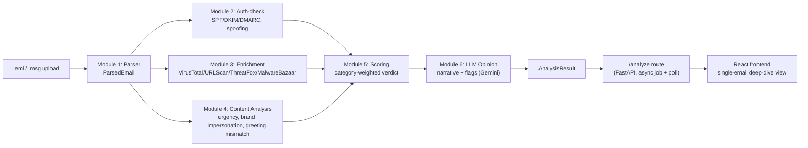
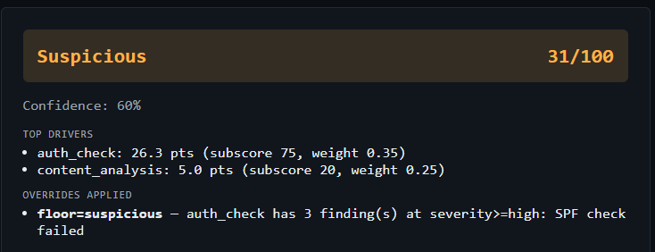
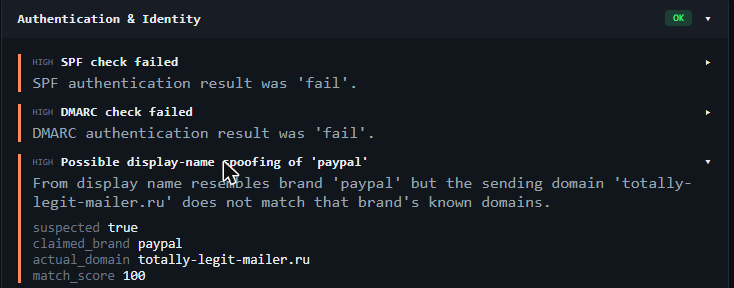
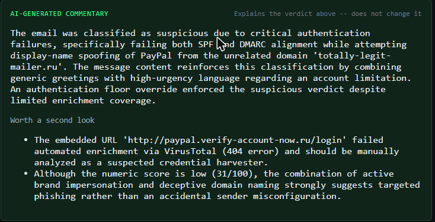

# Mail Analysis

A suspicious-email analysis and triage tool for SOC analysts. Upload a `.eml` or `.msg`
file and get back a scored verdict (Malicious / Suspicious / Needs Manual Review / Legit)
backed by a full evidence trail — every signal that contributed to the verdict is visible
and traceable, not folded into an opaque number. Built as a single-email deep-dive view for
Tier 1 analysts doing hands-on triage, not a batch-processing dashboard.

## Architecture

The pipeline runs six independent analysis stages in sequence, each consuming and producing
a shared, typed data contract:



**The shared contract is the key design choice.** Module 1 (`backend/app/parser/`) parses
raw `.eml`/`.msg` bytes into one `ParsedEmail` object — headers, addresses, body text/HTML,
extracted URLs, attachment hashes — regardless of source format. Every downstream module
(`auth_check`, `enrichment`, `content_analysis`) reads *only* that `ParsedEmail` and
produces a `ModuleResult`: a status plus a list of `Finding`s, each with a uniform shape
(`module`, `severity`, `title`, `description`, `evidence`, `weight`). Module 5
(`backend/app/scoring/`) reads a list of `ModuleResult`s — it doesn't know or care how they
were produced — and assembles the final `AnalysisResult`. Module 6 reads that
`AnalysisResult` and adds an `LLMOpinion`.

This meant each module could be built, tested, and reasoned about in isolation: enrichment
was developed and unit-tested with dependency-injected stub provider clients, content
heuristics with hand-built `ParsedEmail` fixtures, scoring with hand-built `ModuleResult`
lists — none of them needed a working end-to-end pipeline to be verified correct.

**`/analyze` is submit → poll → result, not a blocking request.** This was a deliberate
architectural decision, not an implementation shortcut. `POST /analyze` validates the
upload, kicks off the pipeline on a background thread, and returns `202` with a `job_id`
immediately; `GET /analyze/{job_id}` polls for status (`pending` → `running` → `done`/
`error`), including which module is currently executing. The reason: Module 3's enrichment
step throttles VirusTotal lookups to 4 requests/minute (its free-tier limit), and with the
default cap of 10 URLs + 10 attachment hashes per email, a link-heavy phishing sample can
legitimately take several minutes to fully enrich. A synchronous request would either time
out at the browser/proxy layer or force an analyst to stare at a blocked tab — polling with
live per-step progress was the correct shape for that latency profile, not an afterthought
bolted on later.

## Design rationale

### Scoring: category-weighted aggregation, not a flat point sum

`backend/app/scoring/` combines Findings from three signal categories using explicit,
inspectable weights (`ScoringConfig` in `scoring/config.py`):

| Category | Weight | Why |
|---|---|---|
| `enrichment` | 0.40 | External threat-intel hits (VirusTotal, ThreatFox, etc.) are the most objective signal available |
| `auth_check` | 0.35 | Protocol-level SPF/DKIM/DMARC and identity checks are reliable, low-noise |
| `content_analysis` | 0.25 | Fixed-phrase/heuristic signals are the softest, most tunable-later signal |

A flat point-sum treats every finding as equally trustworthy, which doesn't match how an
analyst actually reasons about evidence: a single confirmed-malicious VirusTotal hit is
worth more than a pile of soft content heuristics (urgency language, a generic greeting)
that could just as easily describe an aggressive-but-legitimate marketing email. So on top
of the weighted score, `scoring/overrides.py` applies explicit **floor and ceiling rules**:

- **Floor**: a single `severity="critical"` enrichment finding, or a single
  `severity="high"` auth_check finding (a confirmed SPF/DMARC failure or display-name
  spoofing), forces the verdict to at least *Suspicious* — regardless of what the weighted
  score alone would produce. One hard indicator outranks a pile of soft ones.
- **Content-only floor**: content_analysis's weight (0.25) means it can never mathematically
  cross the *Suspicious* score threshold (35) through weighted scoring alone — so 2+
  independently-firing high-severity content findings (e.g. urgency language *and* brand
  impersonation both firing) get their own floor to *Suspicious*, so a strong content-only
  signal still surfaces.
- **Ceiling**: content_analysis alone — with `auth_check` and `enrichment` both quiet — can
  never push the verdict to *Malicious*. Heuristic-only evidence isn't allowed to be the
  sole basis for the most severe verdict.
- **Needs-review**: a confidence score (separate from the risk score) tracks how much
  reliable data actually went into the analysis — was an `Authentication-Results` header
  even present, did enrichment providers respond or come back rate-limited. When confidence
  is low and the score is non-trivial, the verdict becomes *Needs Manual Review* rather than
  guessing — this distinguishes "checked and clean" from "couldn't check," which a raw score
  can't express on its own.

### LLM opinion: commentary, never a second verdict

Module 6 (`backend/app/llm/`) sends Gemini the already-computed `AnalysisResult` — the
verdict, score, category breakdown, and every `Finding` with its evidence — and asks for two
things only: a plain-language narrative explaining *why* the verdict landed where it did,
and a list of things worth a second human look. The prompt explicitly forbids stating or
implying a different verdict than the one already computed by Module 5.

This is deliberate scope discipline, not a missed opportunity to let the LLM "do more." A
tool that shows an analyst two verdicts from two sources — a rule-based one and an
LLM-generated one — that can silently disagree is worse than one authoritative verdict with
supporting commentary: it forces the analyst to arbitrate between two systems instead of
trusting either. The rule-based scoring engine is auditable, deterministic, and already
carries its own full evidence trail; the LLM's job is to make that reasoning readable, not
to compete with it. If the LLM's narrative reveals something the rules missed, it surfaces
as a flagged note for human review, not an overriding verdict.

## Testing & real-world validation

The backend has 61 tests, all network-isolated via dependency injection — every module that
touches an external service (`enrichment`'s provider clients, `llm`'s Gemini client) accepts
an injectable client so tests run against stub responses shaped like real provider payloads,
never live calls.

**The centerpiece: real-world data surfaced a bug synthetic fixtures had been hiding.**
Every `.eml` test fixture in this project was hand-built with clean, RFC-compliant headers.
When a real (sanitized) `.msg` sample was finally added to close out a known fixture gap, it
immediately broke Module 2's auth-check parser: the sample's `Authentication-Results` header
was genuinely Microsoft/Office365-generated, and it violated RFC 8601 in two ways the
`authres` library's strict parser rejected outright — no `authserv-id` before the first
result token, and a trailing `;` after the last one. The parse failure meant SPF/DKIM/DMARC
results were silently discarded entirely, degrading to "no data available" — which, for this
specific sample, meant a real `dmarc=fail` was being hidden. The verdict flipped from a
correct **Suspicious** to a false-negative **Legit** purely because the header didn't match
the textbook shape every prior test fixture happened to use. Fixed with a normalize-and-retry
step (strip the trailing `;`, synthesize a placeholder authserv-id) plus a regex-based
fallback extraction so a method result can never be silently lost to an unanticipated
formatting quirk again.

The same `.msg` sample also caught a second, `.msg`-specific bug: `extract-msg`'s `htmlBody`
property is always `bytes`, never `str` (confirmed by reading its source) — an
`isinstance(x, str)` check in the original parser silently discarded the HTML body on every
single `.msg` file, falling back to plain text. Fixed by decoding via `BeautifulSoup`'s own
`UnicodeDammit` encoding-detection utility.

Neither bug was `.eml`-only or `.msg`-only in a clean way: the `authres` parsing bug would
have affected `.eml` too, it just never had a chance to — every `.eml` fixture in the repo
was synthetic and RFC-clean. It's a concrete example of why testing against real-world
samples matters even when synthetic fixtures already provide good structural coverage.

## Screenshots

*(placeholders — real screenshots from the scrubbed `.msg` sample and a live run to be added)*

- **Summary/verdict card** — final verdict, score, confidence, and top scoring drivers
  
- **Expanded per-module evidence panel** — a module's Findings with evidence drilled down
  
- **LLM opinion card** — visually distinct from the rule-based verdict sections above it
  

## Tech stack & setup

**Backend**: Python, FastAPI, Pydantic v2. Key libraries: `authres` (SPF/DKIM/DMARC
parsing), `rapidfuzz` (fuzzy brand matching), `beautifulsoup4` (HTML parsing),
`extract-msg` (Outlook `.msg` parsing), `google-genai` (Gemini). Full list in
`backend/requirements.txt`.

**Frontend**: React 19, Vite, TypeScript. Vitest + React Testing Library for tests.

**Enrichment**: reuses provider integrations (VirusTotal, URLScan, ThreatFox,
MalwareBazaar) from the sibling [IOC_Enricher](#built-alongside-ioc_enricher) project via a
`sys.path` bridge rather than duplicating that code — see `backend/app/enrichment/ioc_bridge.py`.

### Setup

```bash
# Backend
cd backend
python -m venv .venv
.venv\Scripts\activate
pip install -r requirements.txt
copy .env.example .env        # fill in IOC_ENRICHER_PATH (if not a sibling dir) and provider API keys
pytest                        # 61 tests should pass
uvicorn app.main:app --reload # serves on http://localhost:8000

# Frontend (separate terminal)
cd frontend
npm install
npm test                      # Vitest suite
npm run dev                   # serves on http://localhost:5173, proxies /analyze to :8000
```

`backend/.env` holds this project's own copies of provider API keys (`VT_API_KEY`,
`URLSCAN_API_KEY`, `THREATFOX_API_KEY`, `MALWAREBAZAAR_API_KEY`, `GOOGLE_API_KEY`) —
deliberately separate from IOC_Enricher's own `.env`, so this app never depends on that
repo's environment being configured. Any provider without a key configured degrades
gracefully to a "disabled" status per finding rather than failing the analysis.

**Scope note**: this tool is designed to run on a personal/home network only. It is not
hardened for multi-tenant or production deployment — no auth on the API, an in-memory job
store that doesn't survive a restart, and no CORS/reverse-proxy story beyond the local Vite
dev-server proxy.

## Known limitations / next steps

- **Content analysis is deliberately rule-based, not ML-driven.** Module 4 uses fixed
  phrase lists and exact-match brand detection rather than a trained classifier or fuzzy
  NLP. This is a scoping choice, not a gap: it keeps every finding explainable (an analyst
  can see the exact phrase or brand match that fired) and keeps the false-positive rate low
  and predictable — a deliberate trade-off against the more general but less transparent
  detection an ML model could offer. Module 6 (the LLM layer) is where more open-ended
  pattern recognition lives, scoped narrowly as commentary rather than a verdict source.
- **The `.msg` test fixture validates pipeline correctness, not phishing-pattern coverage.**
  The real sample used to close out the `.msg` parsing gap (and that found the two bugs
  above) is a short, benign test email — genuinely useful for exercising encoding and
  header-format edge cases, but it doesn't exercise Module 4's content heuristics or Module
  3's enrichment against a real malicious `.msg` payload the way the hand-built `.eml`
  phishing fixtures do. A real (sanitized) phishing-shaped `.msg` sample is a natural next
  addition.
- **No production/multi-tenant hardening**, per the scope note above — this is a portfolio
  and personal-use tool, not a deployment-ready service.

## Built alongside: IOC_Enricher

This project reuses provider-integration code (VirusTotal, AbuseIPDB, OTX, URLScan,
ThreatFox, MalwareBazaar, RDAP) and scoring logic from a separate, earlier project —
**IOC_Enricher** — a standalone IOC lookup and batch-enrichment tool with its own FastAPI
backend and React frontend. Rather than duplicating that provider-integration code,
Mail Analysis imports it directly via a `sys.path` bridge (see
`backend/app/enrichment/ioc_bridge.py` and `backend/app/llm/gemini_bridge.py`), treating it
as a local dependency without modifying that repo. IOC_Enricher is a sibling project in this
portfolio, not a subdirectory of this one — see its own repo for details.
